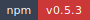
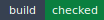
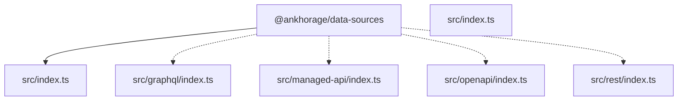

<!-- markdownlint-disable MD013 MD033 -->
<!-- This file is generated by Paradox. Do not edit manually. -->

# @ankhorage/data-sources

        

Provider-neutral data source and endpoint system for APIs, databases, and runtime bindings.

## Generated documentation

- [Interactive documentation app](././paradox/index.html)
- [Public API reference](././paradox/exports.md)
- [Component registry](././paradox/components.md)
- [Architecture overview](././paradox/diagrams/architecture-overview.mmd)
- [Module relationships](././paradox/diagrams/module-relationships.mmd)
- [Export graph](././paradox/diagrams/export-graph.mmd)
- [createManagedApiResourceSchema sequence](././paradox/diagrams/sequences/create-managed-api-resource-schema.mmd)
- [createManualRestDataSource sequence](././paradox/diagrams/sequences/create-manual-rest-data-source.mmd)
- [normalizeGraphQlIntrospectionOperations sequence](././paradox/diagrams/sequences/normalize-graph-ql-introspection-operations.mmd)
- [normalizeGraphQlIntrospectionSchemas sequence](././paradox/diagrams/sequences/normalize-graph-ql-introspection-schemas.mmd)
- [normalizeManualRestDataSource sequence](././paradox/diagrams/sequences/normalize-manual-rest-data-source.mmd)
- [normalizeOpenApiSchema sequence](././paradox/diagrams/sequences/normalize-open-api-schema.mmd)
- [validateManagedApiDefinition sequence](././paradox/diagrams/sequences/validate-managed-api-definition.mmd)
- [validateManualRestDataSource sequence](././paradox/diagrams/sequences/validate-manual-rest-data-source.mmd)

## Architecture preview

Architecture overview

